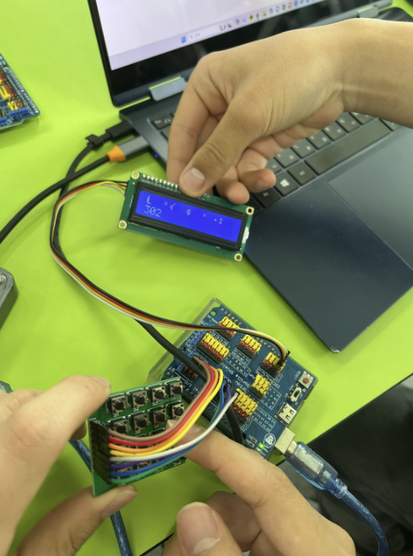
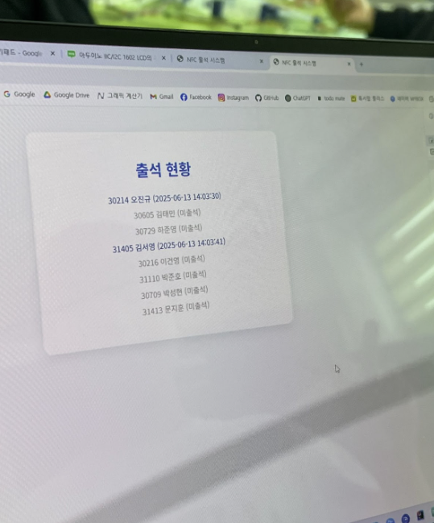
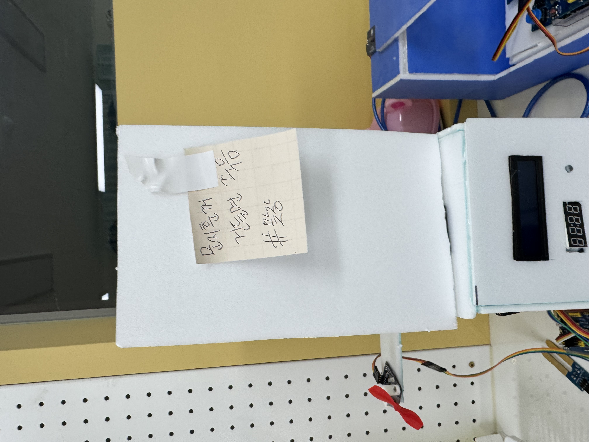
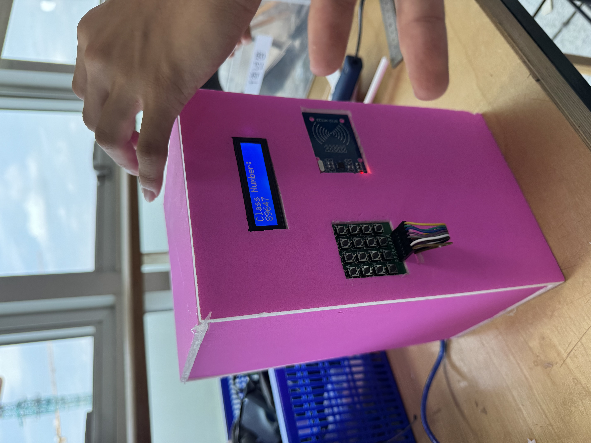
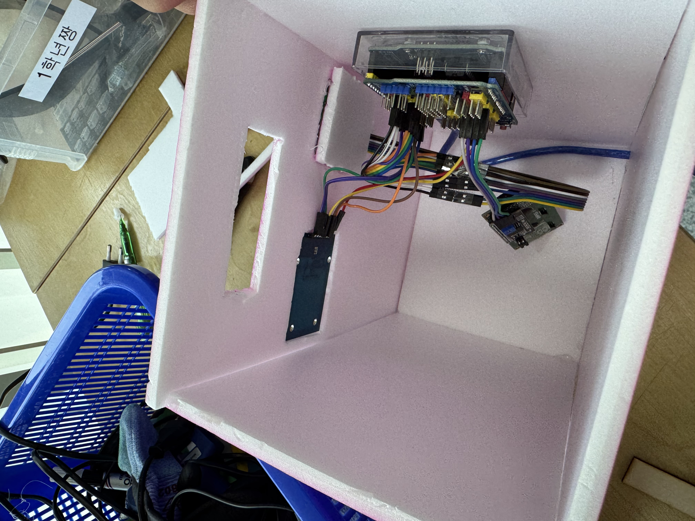

## 작업 일지

### 25/05/02/금 - 1차시
- 라즈베리파이 OS 설치
- 라즈베리파이 한글, 한글 입력기 설치 완료
- 라즈베리파이 파이썬 설치

### 25/05/23/금 - 2차시
- RC522 모듈 납땜 & 배선
- 출석 체크 프로그램 테스트용 제작
- NFC 모듈 학번 입력 완료

### 25/05/30/금 - 3차시
- RC522 모듈 아두이노로 테스트 → 실패
- 라즈베리파이 VSC 설치 시도 → 오류 발생 → 설치 성공 → flask 웹서버 구현 시작
- 프론트엔드 설계, 디자인
- 노트북으로 웹서버 구현 후 라즈베리파이에 이식하기로 결정. & RC522 모듈 오류로 인해 태깅 정보는 더미 데이터를 넣어 구현 예정.

느낀 점 : RC522 모듈이 라즈베리파이와 아두이노 양쪽에서 모두 정상적으로 작동하지 않아 실제 태깅 데이터를 사용할 수 없었던 점이 아쉬웠다.

처음에는 하드웨어와 소프트웨어가 매끄럽게 연결될 거라고 생각했는데, 실제로는 예상치 못한 문제가 언제든 발생할 수 있다는 점을 다시 한 번 깨달았다.

### 25/06/13/금 - 4차시
- 아두이노와 Flask 연동
  
  

    - 사진 상으로는 LCD가 깨져 보이는데, 이후 출력물을 영어로 바꾸면서 해결.

- 아두이노 4x4 매트릭스로 입력한 학번을 LCD에 띄우고, Flask 웹서버로 이동해 출석 여부를 출력함.
    
  
    
    

- 이후에 하드웨어를 숨길 외형을 디자인하여 제작했음.
    
  

### 25/07/04/금 - 5차시
- 저번에 만든 작품 케이스가 파손당함 → 개 사고 발생

- 그래서 다시 만들었음
  

  

- 저번에는 잘 됐던 프로그램이 갑자기 안 되니 당황스러웠음
    - 1시간 정도 수정한 끝에 프로그램이 다시 잘 작동함
    - 수정한 프로그램을 라즈베리파이에 연결하고 작동 테스트를 해 봄
    - 아주 싹싹 잘 돼서 기분 째졌음
 
- 라즈베리파이와 아두이노를 연결함
    - 7월 4일 영상 참고
